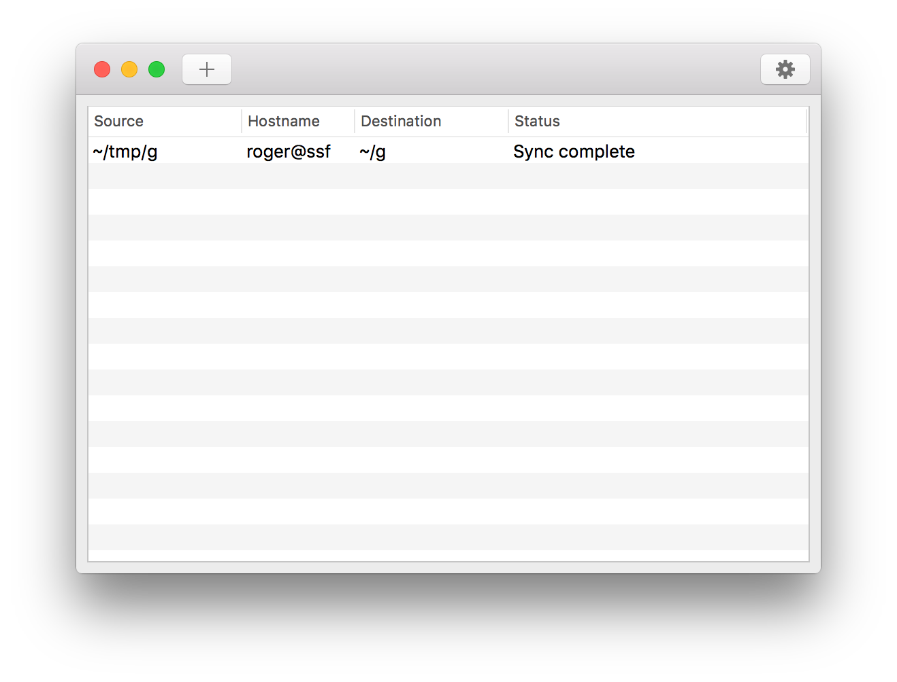
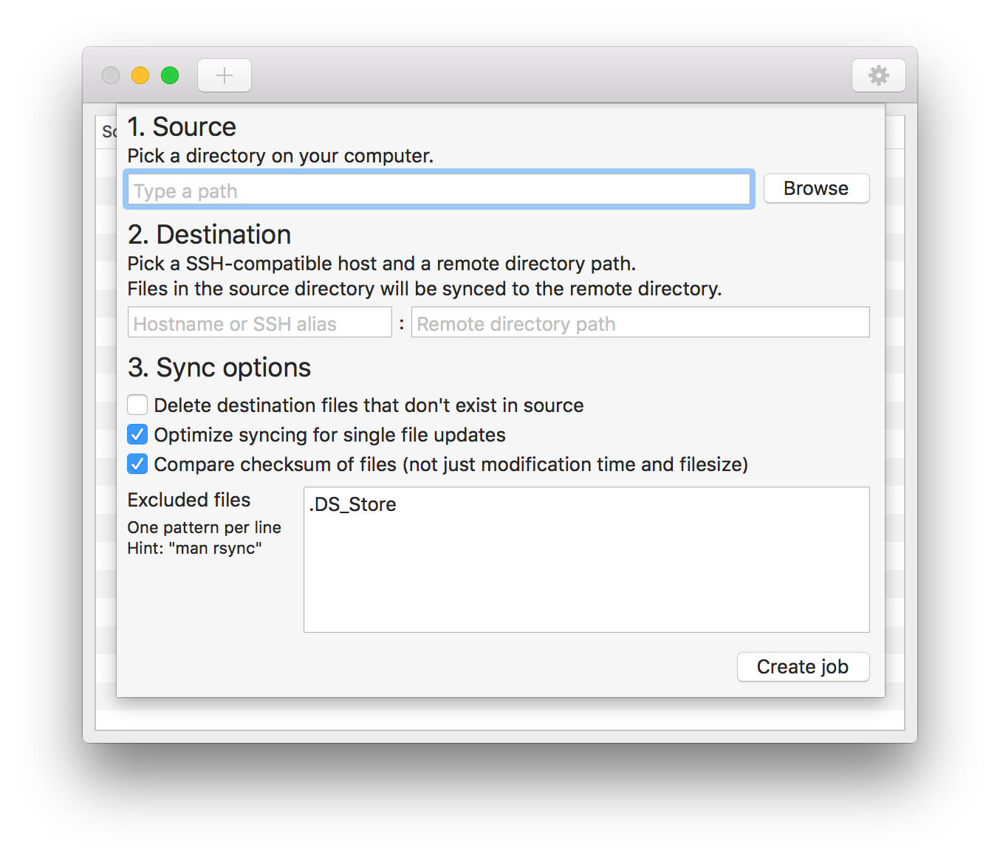
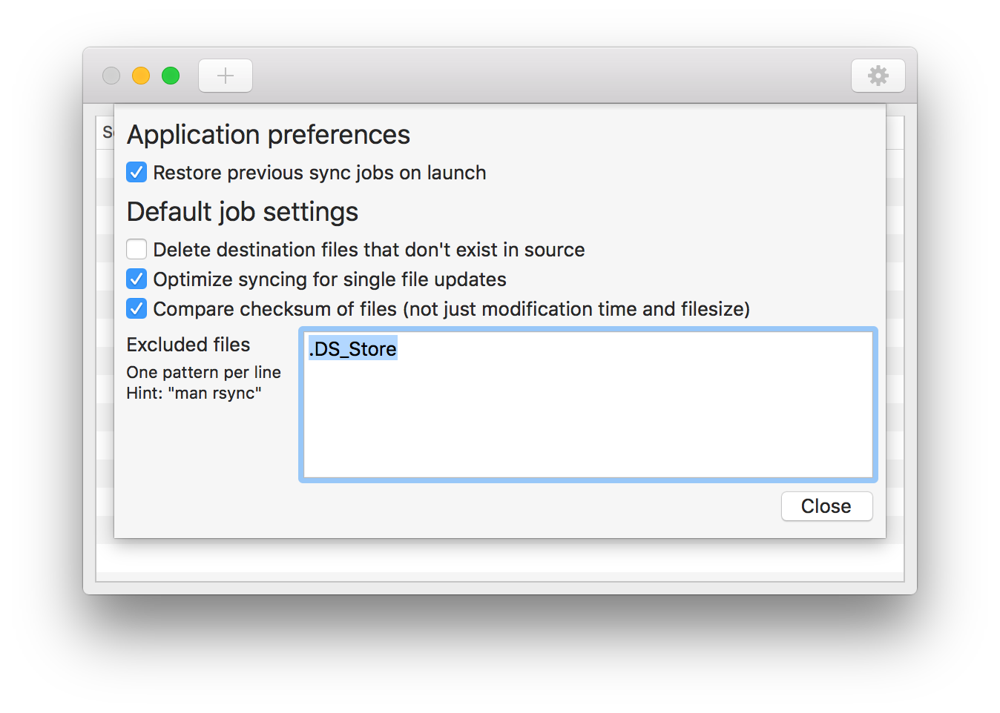

# Super Mega Awesome NYAN

A macOS application for continuously syncing folders to servers via rsync.

## Description

This app lets you sync a folder from your macOS computer to any SSH/rsync-capable server. When you make changes to the source folder, SMAN will automatically trigger another sync. SMAN is designed to sync files quickly, so you can push source code to a server without interrupting your workflow.

The SMAN user interface lets you create one or more *sync jobs*. Each job has a source directory, which can be any directory on your file system. Each job also has a SSH hostname and a destination path. You can configure rsync to exclude certain files or file patterns from the sync job. Exclude patterns follow the same syntax as in rsync.

## Installation

You can download SMAN with [Homebrew Cask](https://caskroom.github.io/) or download the source code and build it with Xcode. Here are instructions for installing SMAN using Homebrew Cask:

```bash
# Add the SMAN software source
brew tap rogerhub/sman

# Install the latest stable version of SMAN
brew cask install sman
```

## Screenshots





## Compatible servers

SMAN uses rsync to transfer files efficiently. Rsync comes with macOS, and it's also preinstalled on virtually all Linux, Solaris, and BSD distributions. **You must set up SSH key authentication** on your servers, so rsync can connect to them without prompting you for a password. The server must also already be registered with your own `known_hosts` list.

## Reduce sync latency

You can speed up SMAN even more by enabling SSH connection sharing with your `ssh_config`. Connection sharing allows you to use a single TCP stream to multiplex many SSH sessions to a single server. Using SSH connection sharing will allow rsync to avoid setting up a new SSH connection every time a sync occurs.

You can enable SSH connection sharing using the `ControlMaster` and `ControlPath` options in your `.ssh/config` file.

```
Host my-server
  User roger
  Hostname my-server.example.com
  ControlMaster auto
  ControlPath ~/.ssh/ctl/%L-%r@%h:%p
```

## Exclude patterns

Here are some examples of exclude patterns you can use:

* `.DS_Store` &mdash; A simple pattern to match an exact file name
* `/.git` &mdash; Only matches when ".git" is matched at the root of the source directory
* `cache/` &mdash; Only matches directories named "cache". Files named "cache" are not matched
* `*.tmp` &mdash; Matches anything that ends in ".tmp"
* `build/*.S` &mdash; The asterisk matches anything, except slashes. So, this rule matches anything that ends in ".S" directly inside a "build" folder.
* `build/**.S` &mdash; The double-star matches anything, including slashes. So, this rule matches anything that ends in ".S" anywhere inside a "build" folder.

## Troubleshooting

To troubleshoot problems with syncing, try running rsync from the terminal. For example, if your sync job has hostname `Host` and destination path `/Path/`, then run:

```bash
# Print a directory listing of /Path/ on the server
rsync Host:/Path/
```

This step should address any connection problems. You should also verify that your SSH user account has permission to write to the destination path.

You can find more details about SMAN failures by right clicking a single job and selecting **View logs**. The logs will show you the full rsync parameters and any error messages that were displayed. A short error message may also be visible in the "Status" column of the SMAN user interface.

## Technical details

SMAN uses the macOS FSEvents API to efficiently receive notifications of changes to the source directory. If a directory changes because of an external event (like a remote directory mounted with SSHFS), then SMAN will not notice the change. However, you can manually sync any job.

The SMAN user interface is written in Objective C. Some source code from rsync's exclude pattern matcher is included in SMAN to optimize its automatic syncing. For example, if FSEvents reports that a file has changed, but the file matches one of the user's exclude patterns, then SMAN will not request another sync.

By default, SMAN will ask rsync to checksum every file in the source and destination. You can turn off this behavior in SMAN preferences. If you turn off this behavior, then rsync will assume that the contents of 2 files are identical if they have the same name, modification time, and file size. This may improve performance for directories with very large files.

By default, SMAN will attempt to optimize syncing latency when FSEvents only reports that 1 file has changed. (When editing source code, most FSEvents notifications originate from saving changes to a single file.) You can turn this feature off in SMAN preferences, but there's usually no reason to.

## Acknowledgements

I'm not an artist. Thank you to pixabay user <a href="https://pixabay.com/en/users/rosanegra_1-432510/" rel="nofollow">rosanegra_1</a> for the app icon, which is licensed under Creative Commons CC0.

## License

BSD 2-clause license (see LICENSE.txt)
